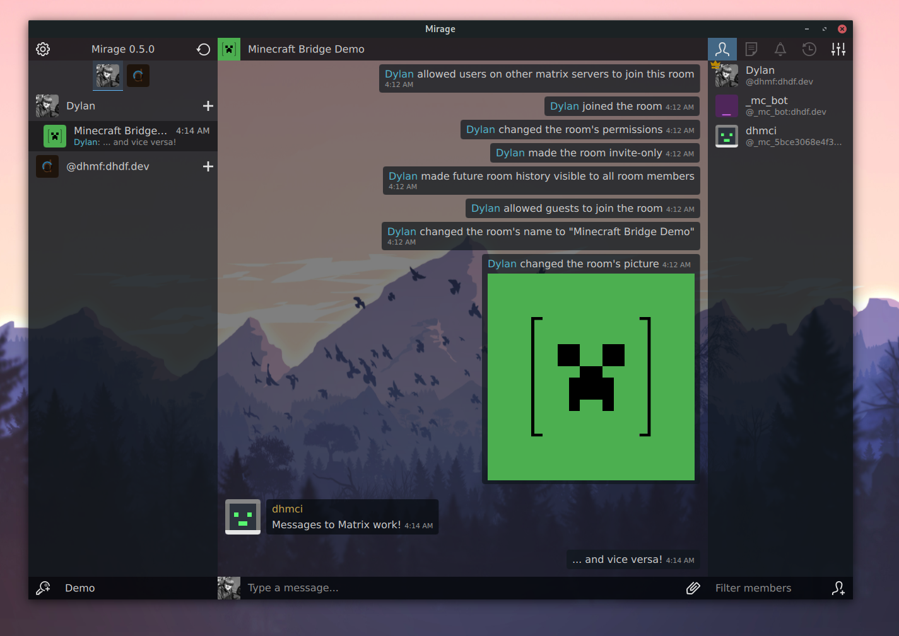

# Matrix Minecraft Bridge

**This Project is in Beta**

A bridge between [Matrix](https://matrix.org/) 
and [Minecraft](https://www.minecraft.net/)


## Features
 - [x] Minecraft
   - [x] Retrieve matrix messages
      - [x] m.emotes
      - [x] m.text
      - [ ] m.notice
   - [ ] Send messages
      - [ ] Player events (ie deaths, kicks, advancements, etc.)
         - [ ] Joins/Leaves/kicks
         - [ ] Deaths
            - [ ] Easy (hit the ground too hard, etc)
            - [ ] Hard (<player> was slain by <player/mob> using <item>, <player> walked into fire whilst fighting <player/mob>, etc.)
         - [ ] Advancements
      - [x] Player chat messages / emotes
      - [ ] Arbitrary command execution from matrix
 - [x] Matrix
   - [x] In-sync Profiles
      - [x] Player's skin as matrix avatar
         - [ ] [3D Head Render](https://crafatar.com/)
      - [x] Player's name as matrix display name
      - [ ] Presence Status
   - [x] Bridge / Unbridge with commands
   - [ ] [Counters](https://github.com/vector-im/riot-web/blob/develop/docs/labs.md#render-simple-counters-in-room-header-feature_state_counters)


## Description
This is a Matrix appservice that communicates between a plugin based
Minecraft server and Matrix. The Minecraft server must have a proper
plugin (see compatible plugins below). 

## Setup
To set up follow this process then go to a compatible plugin and follow it's
setup process. If you already know where an instance of this application is
running then all that is left is setting up the plugin.
```shell script
# Install all the needed dependencies
npm install -P

# Generate the configuration
npm run setup

# ... configure ./config/config.yaml

# Make your matrix server point to the appservice.yaml

# finally run
npm start
```

## Leave a Star!
It means a lot

## Developing
Join us in our Matrix room
[#minecraft:dhdf.dev](https://matrix.to/#/!RUdwKvpeiDnWUyWSMJ:dhdf.dev?via=dhdf.dev)

## Compatible Plugins:
 - [Matrix Plugin](https://github.com/dylhack/matrix-plugin)
   - By @dhghf

## Screenshots




